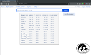
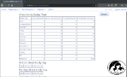

# KumoReg

Convention Registration Management

- At-Convention and pre-registered attendee check in
- Badge printing                                              
- Reporting                                                      
- Roles and permission management                                
- Allow only certain users to search for / edit / check in       
  attendees / set prices manually                                

 
 

   
# Requirements
- Java 8
- MySQL

# Table of Contents
- [Installation](docs/installation.md)
- [Security](docs/security/introduction.md)
    - [Rights](docs/security/rights.md)
    - [Roles](docs/security/roles.md)
- [Data Import Format](docs/PreRegDataImportFormat.md)